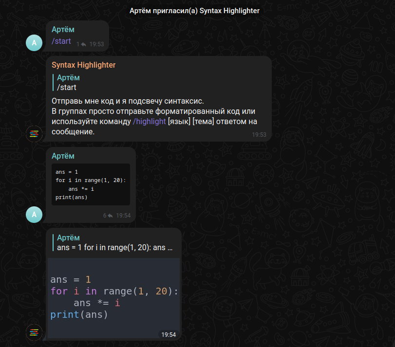

# Тонкости работы ботов в группах

Бота можно добавить в группу. Для этого разработчик должен разрешить вступление в группы в настройках бота в BotFather.

В публичную группу — группу с юзернеймом — ботов могут добавлять только админы. Боту можно дать права администратора в
группе, чтобы он мог выполнять действия админов: например, удалять пользователей. 

В одной группе может быть до 20 ботов.

## Privacy mode: видимость сообщений в группах

Обычно бот должен реагировать только на [команды](../messages/commands.md).
Телеграм не уведомляет бота об остальных сообщениях,
и это гарантирует приватность переписки для участников чата.

Тем не менее, некоторым ботам необходимо видеть другие сообщения в группе: например, если это чатбот или антиспам-бот.
Разработчики таких ботов могут отключить Privacy mode.

Privacy mode — настройка в BotFather, которая по умолчанию включена. В таком режиме бот в группах видит только
некоторые сообщения:

- [команды;](/ru/chats/commands/)
- системные сообщения;
- сообщения с [упоминанием бота;](/ru/chats/markup/)
- ответы на сообщение бота, ответы на ответы и так далее.

Если бот — админ в группе, то он в любом случае видит все сообщения.

Бот, работающий через Bot API, в любом случае не будет видеть сообщения от других ботов.

В списке участников группы видно, включен ли Privacy mode:

::: warning Не получается отключить Privacy mode?
Если вы отключили Privacy mode, удалите бота из группы и добавьте заново.
:::

## Сообщения от лица групп и каналов

При разработке ботов для групп учитывайте, что сообщения в группах могут приходить не только от лица пользователей, но
также:

- из привязанного к группе канала (с точки зрения API это пересланные сообщения);
- от лица группы от анонимных администраторов той же группы;
- от лица публичных каналов от премиум-пользователей.

Корректно обрабатывайте такие случаи.

## Ссылки по теме

- [О Privacy mode в документации к API](https://core.telegram.org/bots/features#privacy-mode)
